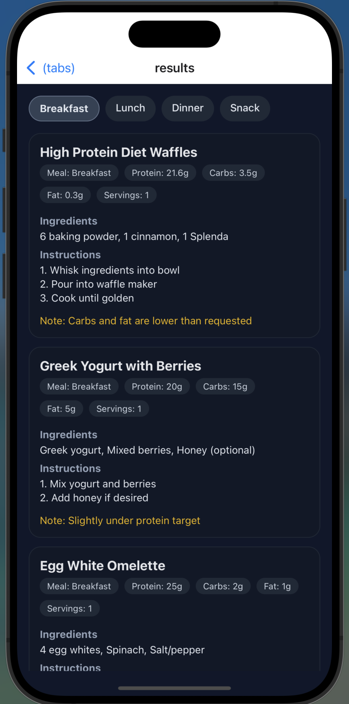
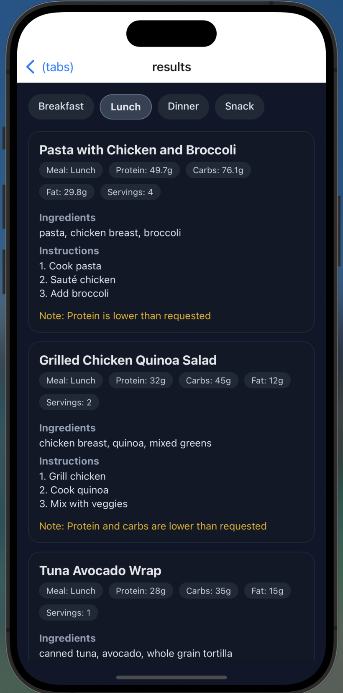
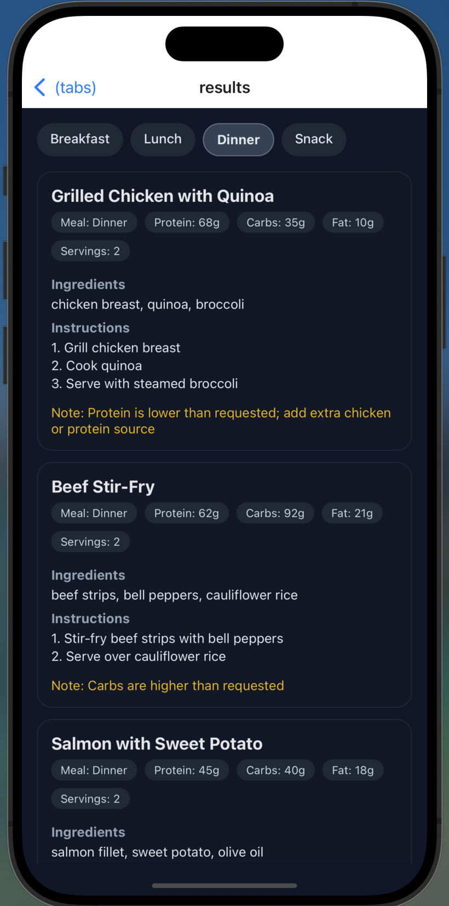
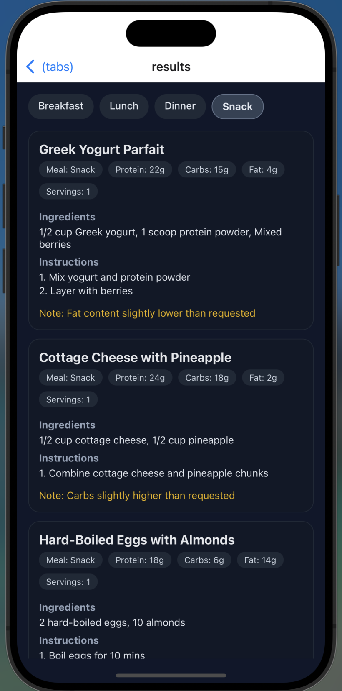

# Components
## Landing Page
Series of questions to generate a user's target macros for breakfast, lunch, dinner, etc. based on inputted meal splits and to also note any dietary restrictions or allergens that the user may have and their desired prep times.

## Recipes Page
After completing landing page, sends a request to a Lambda function endpoint to query [Custom MacroRecipe RAG](https://github.com/ShubhanYenuganti/MacroRecipeLLM). It then displays the results for the user to review. 

# Screenshots

### Recipes Page

